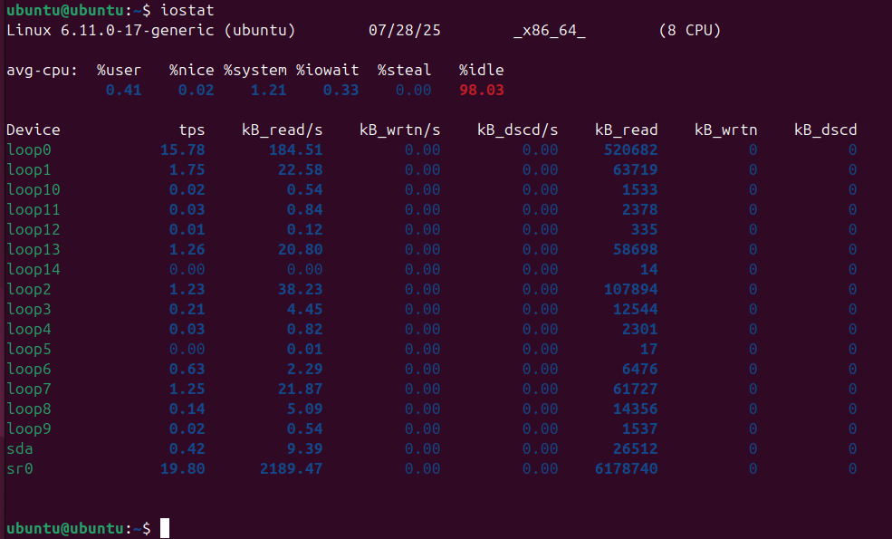
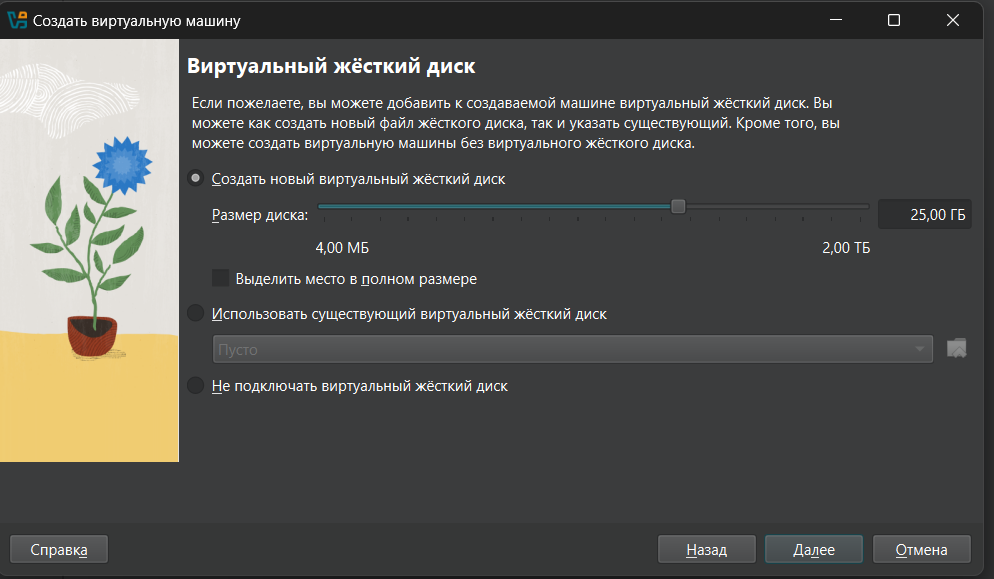
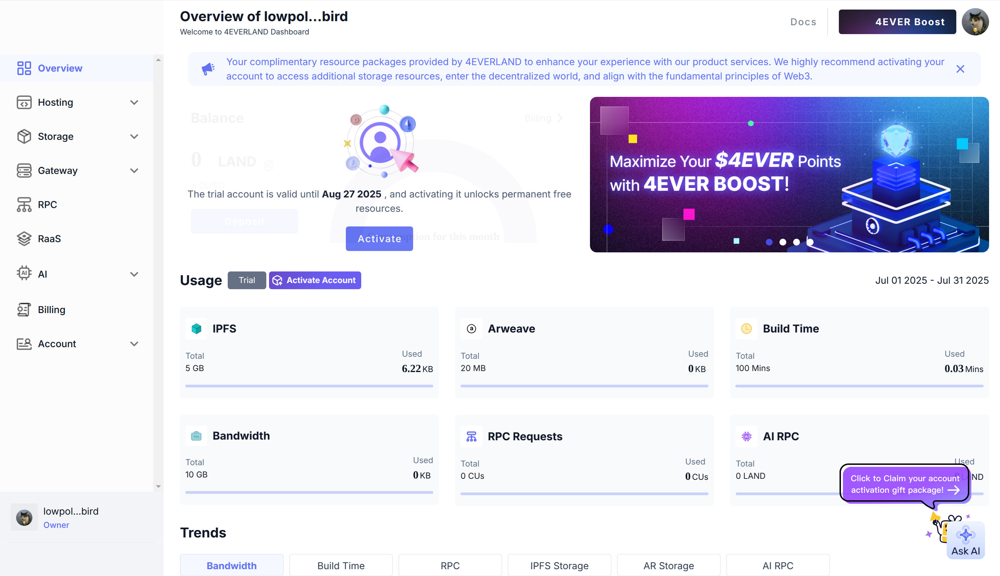
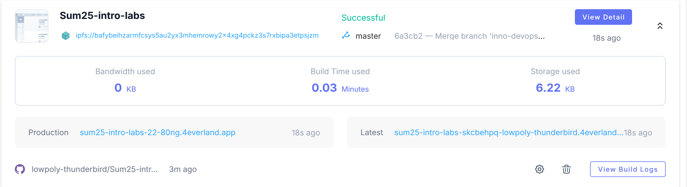
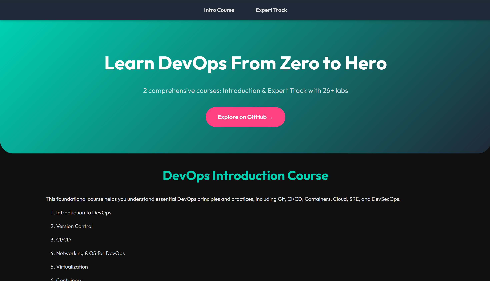

# Decentralized Web Hosting with IPFS & 4EVERLAND
## Task 1: Local IPFS Node Setup and File Publishing
### 1) Start IPFS container
```bash
$ docker run -d --name ipfs_node \
  -v ipfs_staging:/export \
  -v ipfs_data:/data/ipfs \
  -p 4001:4001 -p 8080:8080 -p 5001:5001 \
  ipfs/kubo:latest
Unable to find image 'ipfs/kubo:latest' locally
latest: Pulling from ipfs/kubo
c464210ed748: Pull complete 
fbbafa331a87: Pull complete 
3bbd99df312c: Pull complete 
6f8d4a719f75: Pull complete 
df3ff4674392: Pull complete 
15ad94413a1a: Pull complete 
855dc1ee31c1: Pull complete 
48862882b8db: Pull complete 
19e48a34e694: Pull complete 
4f4fb700ef54: Pull complete 
bea9046d120a: Pull complete 
c5ac5aac3fba: Pull complete 
bfa3e979aaa5: Pull complete 
Digest: sha256:51dd374d5a6a7e1a7c77358701d65bbf558a2e76802d65d4f81b125877811ee1
Status: Downloaded newer image for ipfs/kubo:latest
daskdnvj58b4fd6862348bc327d7710be8d4357ca89f8b95d78987ba494gggfr4
```

### 2) Verify node operation
```bash
$ docker exec ipfs_node ipfs swarm peers
/ip4/101.47.181.11/tcp/36235/p2p/QmV8JNwy9KYEZT8TFz5iyrLJe17bxrHMWVdKyQP5L7K1n7
/ip4/104.238.141.32/tcp/4001/p2p/12D3KooWBH8jQKzLGvgS5frTjXzciMRWtiYHR35JhoXGNK9q2eqd
/ip4/106.160.87.132/tcp/52551/p2p/QmVcp6UfSbMzo23g1yb2S7Ft5cZoPhF9mMTNzmWvwGhH65
/ip4/107.173.229.73/tcp/4001/p2p/12D3KooWN425bJqKXNCu4UPFG9qe9ihqS2ZnaLjqxzhGYrXDk1dq
/ip4/108.62.116.216/udp/4001/quic-v1/p2p/12D3KooWRCbbgLEB83tkftrEe81Y6JEQPFEFNEwc2WPqTFnxVwD9
/ip4/109.234.36.149/tcp/4001/p2p/12D3KooWBu1VpcFV9daZ3h9Zfezp4TWV5tdk8hP2oSb7hnf6RsxS
/ip4/116.203.190.64/tcp/4001/p2p/12D3KooWPQuLtZPMJVPmhu6g6Nt7nWQaeQLwN9DcKSyuMUJTKc41
/ip4/116.203.7.86/tcp/4001/p2p/12D3KooWJ4kRKuTsCNGF8FzBcmFMVXu4iLvvUiW4EQ2fyU6sVEth
/ip4/116.88.59.113/tcp/4001/p2p/12D3KooW9qHeGN8ycWqt4ZsAF77PuhwUgzbVcxRsGc1sYqoVDB1f
/ip4/129.152.26.198/tcp/4001/p2p/12D3KooWRbjrWvBwZxhWEn57AgJSgZ9gtB9hBGdu6xArcfVGgj1X
/ip4/130.51.180.169/tcp/4001/p2p/12D3KooWPKVFt77yKK1n7m3Tthp3AMR9FBCeE4qDrdByeAtL85F9
/ip4/135.181.17.251/tcp/4001/p2p/12D3KooWDfPCZKCbn2V5mUXK1ViY25XVd6B5Z7KnE7KoRW5ZJ5Je
/ip4/135.181.19.237/tcp/40467/p2p/QmR594FR2UHzSYss6oE8ppHiRHACnoNkeA69AY685GkRvg
/ip4/135.181.217.156/tcp/4001/p2p/12D3KooWRHzJFv6nMNCi9C3HCLuNggvd8wh6AhJsvMw19q7HMuph
/ip4/137.220.39.84/tcp/4001/p2p/12D3KooWB3LrrtToNzFfy2wXH99fhTEko41icovhYZ22WHj4Whd5
/ip4/137.220.58.122/tcp/4001/p2p/12D3KooWQif9Edo6a7JnYFbJ1ioY93VJXwB5kVdUg5CStQNivVTP
/ip4/139.178.91.71/udp/4001/quic-v1/p2p/QmNnooDu7bfjPFoTZYxMNLWUQJyrVwtbZg5gBMjTezGAJN
/ip4/140.82.17.66/tcp/4001/p2p/12D3KooWSAiZCyz2RPBfLa2KKUFJozN52knCuvCJH5BF8MfMCP8M
/ip4/141.164.60.146/tcp/4001/p2p/12D3KooWNrqo85sL44CqJjD3CpjpPqinyvuCeZ9Qv8939dN3YgR6
/ip4/141.5.109.150/udp/4001/quic-v1/p2p/12D3KooWDdCeowNSfi4nGL6C1nGEDYH8yh97dzeDXDmEmpqLc5Tm
/ip4/141.95.162.246/tcp/4001/p2p/12D3KooWT1e8xP2hb75fkCW32CNN2NGmzCHHPeQStMgYxmX18KmN
/ip4/144.91.82.204/udp/4001/quic-v1/p2p/12D3KooWKLvBzn1hD16JrB2UzHi4jHPRAN3PvzVg1qf3Ssba4m4Z
/ip4/145.40.118.135/udp/4001/quic-v1/p2p/QmcZf59bWwK5XFi76CZX8cbJ4BhTzzA3gU1ZjYZcYW3dwt
/ip4/147.75.87.27/udp/4001/quic-v1/p2p/QmbLHAnMoJPWSCR5Zhtx6BHJX9KiKNN6tpvbUcqanj75Nb
/ip4/149.248.1.133/tcp/4001/p2p/12D3KooWHW8cq6Utd1vU7VD9Kpu8y2oaV8wnLBmsNeFnhB4vyPSb
/ip4/152.53.83.219/tcp/40401/p2p/QmWbJAycmrXBT4T6oJy7yCa6nvAkAHjzFnzTajy3GWuKrn
/ip4/162.120.18.22/udp/4001/quic-v1/p2p/12D3KooWGA9cvitK54yYDHLdp5rz15ueW9PqSP7fBB2uubTfbbAh
/ip4/162.120.19.28/udp/4001/quic-v1/p2p/12D3KooWCiiHagL8tYAQanTxnFuFLaNvGHRvEiBegxtJREMdY9eV
/ip4/162.250.188.198/udp/4001/quic-v1/p2p/12D3KooWDsVUECZtpdeckgjpnxvV8xQMeNci7m9vpakLpCjTfwyG
/ip4/162.55.134.135/tcp/20401/p2p/12D3KooWAdUiXt5z4wUS5mn1LYrAia3AEwxMTappqsURgHoXe7TR
/ip4/162.55.134.135/tcp/30401/p2p/12D3KooWPKnvYCQdfYu5U4rEvSRmVjyH89eveYjdvCAqBSK3LV72
/ip4/162.55.134.135/tcp/46401/p2p/12D3KooWPnZ4SHziFycsCSYucVACGubABFiZLbbBGuL7ctgc36ui
/ip4/162.55.134.135/tcp/6401/p2p/12D3KooWGtueKRCoKrwQiGE69SXhWGWVBR1wiWcNumYBXKuPnvsK
/ip4/164.68.118.128/udp/4001/quic-v1/p2p/12D3KooWSVPg6TeYB8RX2tSXeUfn5FSA3fC86T65tX2MNVcwMmDz
/ip4/172.245.253.214/tcp/4001/p2p/12D3KooWQS5CMawuSgz2d8v8z7LW3RDH9jsCfkENLyLmD1JmhPaQ
/ip4/172.245.68.89/tcp/4001/p2p/12D3KooWAiktiBY4YFfDncdzGPqxpXW5K161Tnu183fTtQ7bAzrP
/ip4/173.249.28.78/udp/4001/quic-v1/p2p/12D3KooWCGahk8HAa1Sqghd5vXA9xdonGvxZQ1A5EhuTjPf8Um1J
/ip4/174.136.97.180/udp/4001/quic-v1/p2p/12D3KooWPEDBmt7vm6FNNYuqaA4n2qMUZ6wPK5NcRc8t6KpqgRkV
/ip4/176.120.176.38/udp/28284/quic-v1/p2p/12D3KooWJm3yFwPw8eRBi9SM1nnTxxqmcugxqZZDH1VgqDxK6gef
/ip4/185.255.95.215/udp/4001/quic-v1/p2p/12D3KooWRqrzUyq5ubCSgGcEN55ooEtZhDijgzhJwVRsajqpTJZ2
/ip4/192.81.213.80/tcp/4001/p2p/12D3KooWPSKXimwVZEhN13h8DB8nj4iDs39r1wprLr1EnjwAdBCm
/ip4/193.8.130.167/udp/4001/quic-v1/p2p/12D3KooWHWgXoEQswGLSeMujyG4mUN73hNUvKdoSp5Y1wKQ6BrBk
/ip4/194.127.178.121/tcp/4001/p2p/12D3KooWJTM42PQMFsqTbX1hPKj9ANH8GkvtDQddAXFhVBe3o8V9
/ip4/194.242.57.51/udp/4001/quic-v1/p2p/12D3KooWES4SfYjnzbMhvqzCYUA6HGPh9pShXhzep5SPzcuxbXmk
/ip4/198.244.208.145/tcp/4001/p2p/12D3KooWEgrhfR4dt1iHjNG6tjpZEPujuiFo4CCJQNDJEtUQbcKT
/ip4/199.247.30.200/tcp/4001/p2p/12D3KooWSUk6ZFbqaeKv63esafDvWuHUqAVmMsr4gh1kdYFLi4JB
/ip4/207.180.252.8/udp/4001/quic-v1/p2p/12D3KooWQUw6xEWrvoevMuNpKx43iWYJUAqeJWK9EamnYpWSNzGy
/ip4/211.230.145.198/tcp/49276/p2p/QmdRLTdHAJFriM1J9tcB9i39vqqRVishqrxf9yiMEZQ33p
/ip4/212.237.216.68/udp/4001/quic-v1/p2p/12D3KooWGnL82wEQF5M6eLpYMSP7f7RJ9wZVtV19KezV28rmNDve
/ip4/213.246.39.146/udp/4001/quic-v1/p2p/12D3KooWAHgVzE3FE7EJX2eJ25svBizJUFRAg3W8Fw49ZFf6wFU1
/ip4/213.246.39.152/udp/4001/quic-v1/p2p/12D3KooWJ2ae88Fhv1cDjtwMitQ9HoByy3g2h2kJVrgUBZgNmrmp
/ip4/23.95.246.35/tcp/4001/p2p/12D3KooWNM7kEjVzrknHRpVbz6NYD4QQdm9f2Wvxiy7LYBDQ7qNm
/ip4/34.134.112.192/udp/4001/quic-v1/p2p/12D3KooWBWgygA7zg7Ay3oWtALa3ZW2HS6MhM1T7PvnSCok4hQcu
/ip4/34.77.31.164/udp/4001/quic-v1/p2p/12D3KooWNieM3HRBJdVqaQucZEJdqA3oWKrKf3Gx3hp2cmtR9GNK
/ip4/37.218.242.72/udp/4001/quic-v1/p2p/12D3KooWLo2HznGx2rUrrZNbNuKuw6irmRkRdk7rPntGqeNUB3sh
/ip4/38.242.239.187/tcp/4001/p2p/12D3KooWKNrzhMsQEAMWpAo4y9LV87eVCvT7jvYJJqC4YVU14MXE
/ip4/45.15.24.95/tcp/4001/p2p/12D3KooWLD34NS3SbD6WzeWu2MrS6BtqtqkryhNSVBCBjNcd5EfQ
/ip4/45.63.35.254/tcp/4001/p2p/12D3KooWAmQHTysWFYpDT3s7VAUZi7S5KhnFH6d9dd95YrEiCSJY
/ip4/45.76.155.25/tcp/4001/p2p/12D3KooWCL427xtA4a9VVyHuHE9LKzCcshjmg57tC8nMYDsnW3BN
/ip4/46.247.131.197/tcp/4001/p2p/12D3KooWBuV2s5wN75kiCySWQyKeVB94zFwdTTjiDsisSohGbrMr
/ip4/47.187.31.116/tcp/4001/p2p/12D3KooWKau1XrqFB5URggM67QC1CMNyz1xWHrTFPy9owsm5igSF
/ip4/5.9.55.254/tcp/4001/p2p/12D3KooWDejr2RBeCx1Pzjri99PAwYK7RK9naWwuNmtNKsT7ZgLw
/ip4/51.15.183.237/tcp/4001/p2p/12D3KooWDPEMFANUBYj7Ae2DhJ3YVUmXiig3fR3mig4uHP8q5yVn
/ip4/54.151.182.40/tcp/4001/p2p/12D3KooW9wKrxn2Co8B1fpWPyiZmK5DNMeNCqkJsaBzJTAwmA7fq
/ip4/62.171.176.151/udp/4001/quic-v1/p2p/12D3KooWKAnuzzDZiaKku1qByPyUwTBP6w5tGcCvAHPR8nUVZ7Fo
/ip4/65.108.75.228/tcp/4001/p2p/12D3KooWE4cEGTWyPEyVKk92V4w8d3VyNYatC1Rb6G7Ki72gNLPN
/ip4/65.21.137.252/tcp/45969/p2p/QmdGEEecTTvyPmXrLr4vTPg7GZdjfW2c26AwdMNTjro9DY
/ip4/80.208.229.228/udp/4001/quic-v1/p2p/12D3KooWBRvd3UZ8rBBHRhAw7uYJSwmpB2b14dx95xtopz7PFhgY
/ip4/87.121.89.3/tcp/45099/p2p/QmZr3GkFTCGLcE3nPojM7AbRSTwBX6Earytv38ZC6hKJg7
/ip4/89.163.148.109/udp/4001/quic-v1/p2p/12D3KooWMSrkfahgYWvpRWB5cJzXiAzWJeFwYMDXrZJmTWYwHXcH
/ip4/89.58.19.134/tcp/4001/p2p/12D3KooWD6JqtN4vAJnGDQhYLjdK9svShppM4pf1V5zPDS994PrX
/ip4/91.108.226.21/tcp/43801/p2p/QmXFCwubbUY3zPCpRAgrBVGSww1dHdCLXn87xedJNqy7Z5
/ip4/94.156.112.147/tcp/38785/p2p/QmbbdcjXWAybnQVoNpu81amebAG5HvzEkD349k2ebcqnaS
/ip4/94.72.105.248/udp/4001/quic-v1/p2p/12D3KooWBawFaZ3E8weKdZzzuWzpEm3qBXVYqExpesKCagWd47U4
```

### 3) Add file to IPFS
```bash
$ echo "Hello IPFS Lab" > testfile.txt
$ docker cp testfile.txt ipfs_node:/export/
Successfully copied 2.05kB to ipfs_node:/export/

$ docker exec ipfs_node ipfs add /export/testfile.txt
 15 B / 15 B  100.00%added QmUFJmQRosK4Amzcjwbip8kV3gkJ8jqCURjCNxuv3bWYS1 testfile.txt
```

Generated CID is `QmUFJmQRosK4Amzcjwbip8kV3gkJ8jqCURjCNxuv3bWYS1`

### 4) Access content


Content accessed through 
http://localhost:8080/ipfs/QmUFJmQRosK4Amzcjwbip8kV3gkJ8jqCURjCNxuv3bWYS1



Content accessed through
http://ipfs.io/ipfs/QmUFJmQRosK4Amzcjwbip8kV3gkJ8jqCURjCNxuv3bWYS1

WebUI:


## Task 2: Static Site Deployment with Fleek
### 1) Signed In:


### 2) Deployed repo app


- Verify on public gateway: http://sum25-intro-labs-xwr873cs-dm1stry.4everland.app/



Verify on public gateway: https://ipfs.io/ipfs/bafybeihzarmfcsys5au2yx3mhemrowy2x4xg4pckz3s7rxbipa3etpsjzm

## Task 1 Results
- IPFS Node Peer Count: 576
- IPFS Node Bandwidth: Incoming 33 KiB/s, outgoing 33 KiB/s
- Test File CID: QmUFJmQRosK4Amzcjwbip8kV3gkJ8jqCURjCNxuv3bWYS1
- Public Gateway URL: `https://ipfs.io/ipfs/QmUFJmQRosK4Amzcjwbip8kV3gkJ8jqCURjCNxuv3bWYS1`

## Task 2 Results
- 4EVERLAND Project URL: `https://sum25-intro-labs-3govxwgh-valikv.4everland.app/`
- IPFS CID from 4EVERLAND: `bafybeihzarmfcsys5au2yx3mhemrowy2x4xg4pckz3s7rxbipa3etpsjzm`