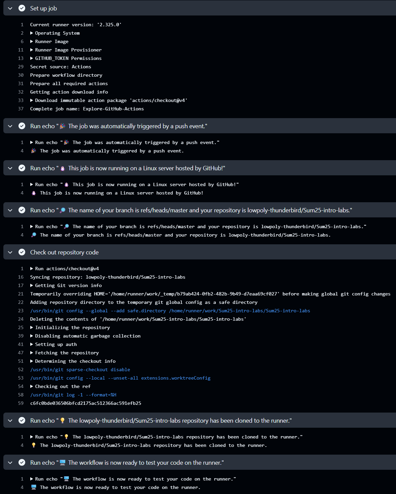
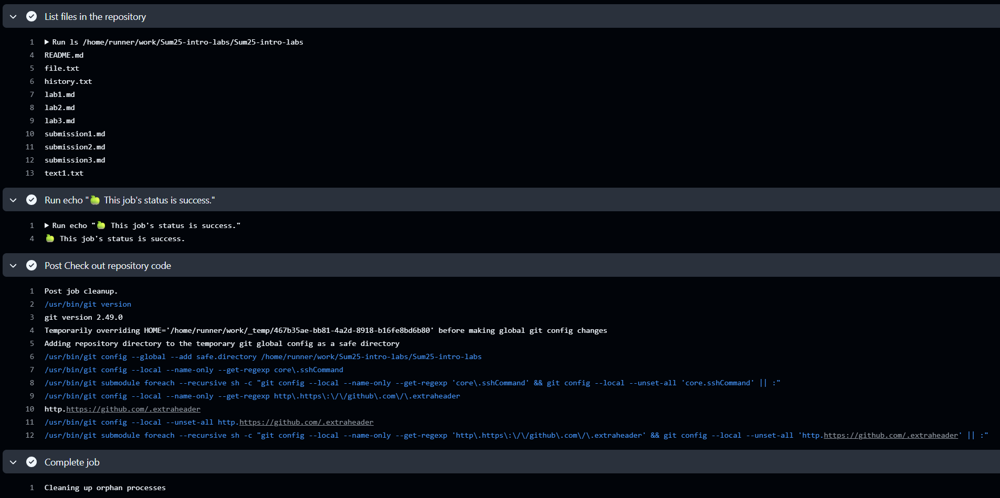
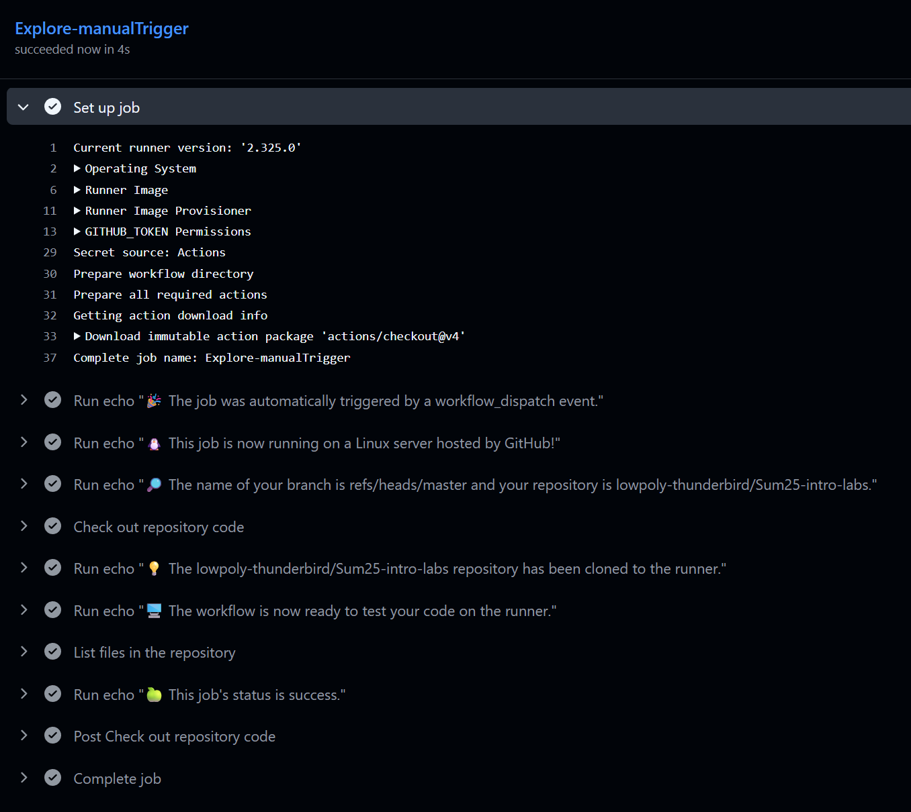

Я ознакомился с официальным quickstart guide по GitHub Actions. Основные концепции:

Workflows - автоматизированные процессы, которые вы настраиваете в своем репозитории

Events - действия, которые запускают workflow (push, pull request и др.)

Jobs - набор шагов, которые выполняются на том же runner'е

Steps - отдельные задачи, которые могут запускать команды или actions

Actions - отдельные команды, которые можно использовать в workflow

Шаг 2: Создание workflow файла
В своем репозитории я создал директорию .github/workflows/

В этой директории создал файл first-workflow.yml со следующим содержимым:

```yaml
name: GitHub Actions Demo
run-name: ${{ github.actor }} is testing out GitHub Actions 🚀
on: [push]
jobs:
  Explore-GitHub-Actions:
    runs-on: ubuntu-latest
    steps:
      - run: echo "🎉 The job was automatically triggered by a ${{ github.event_name }} event."
      - run: echo "🐧 This job is now running on a ${{ runner.os }} server hosted by GitHub!"
      - run: echo "🔎 The name of your branch is ${{ github.ref }} and your repository is ${{ github.repository }}."
      - name: Check out repository code
        uses: actions/checkout@v4
      - run: echo "💡 The ${{ github.repository }} repository has been cloned to the runner."
      - run: echo "🖥️ The workflow is now ready to test your code on the runner."
      - name: List files in the repository
        run: |
          ls ${{ github.workspace }}
      - run: echo "🍏 This job's status is ${{ job.status }}."
```

Шаг 3: Наблюдение за выполнением workflow
После push'а изменений в репозиторий:

На вкладке "Actions" в GitHub я увидел запущенный workflow

Workflow успешно завершился примерно за 10 секунд


# задание 2
я создал ручной workflow и запустил его, вот результат выполнения:



