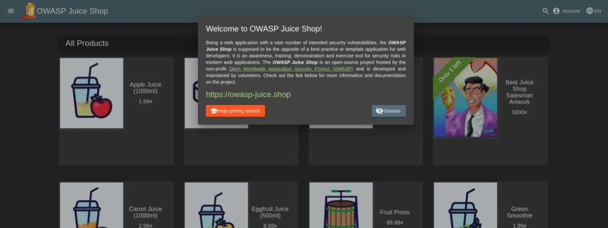
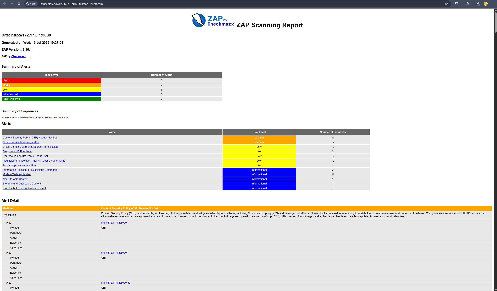

Virtualization Lab
In this lab, you will learn how to deploy a Virtual Machine (VM) using VirtualBox and customize its settings. Follow the tasks below to complete the lab assignment.

Task 1: VM Deployment
Objective: Install VirtualBox and deploy a new VM using Ubuntu.

Install VirtualBox:

Download and install VirtualBox from the official VirtualBox website.
Provide the version number of VirtualBox in your report. (v. 7.1.12)
Deploy a Virtual Machine:

Create a new Virtual Machine (VM) using VirtualBox and choose the Ubuntu operating system.

Customize the VM settings, such as the allocated memory, number of CPU cores, and network configuration.
Document the steps you followed to deploy the VM, including any specific configurations you made.
Take a screenshot of the VM running and include it in your report.

Documentation:

Create a submission5.md file.
Include the VirtualBox version number.
Document the steps and configurations made during the VM deployment.
Add a screenshot of the running VM in the submission5.md file.

Task 2: System Information Tools
Objective: Discover and use command-line tools to display system information of the VM.

Processor, RAM, and Network Information:

Research and discover a suitable command-line tool for displaying processor, RAM, and network information separately.
Install the tool on your VM if needed.
Use the tool to display the processor, RAM, and network information of the VM.

sudo apt install -y lshw htop net-tools
lscpu

