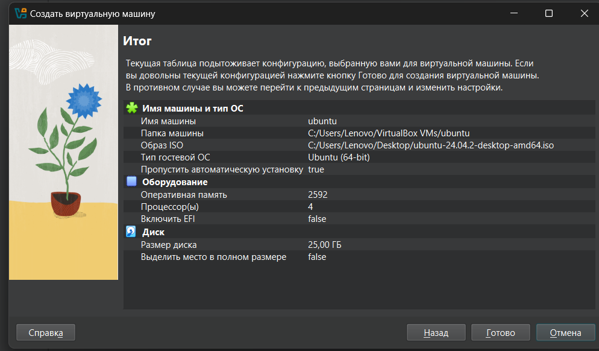
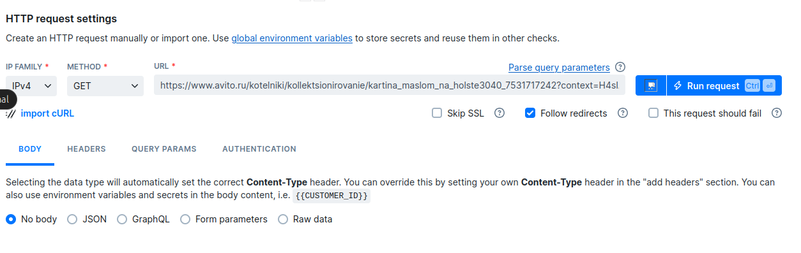
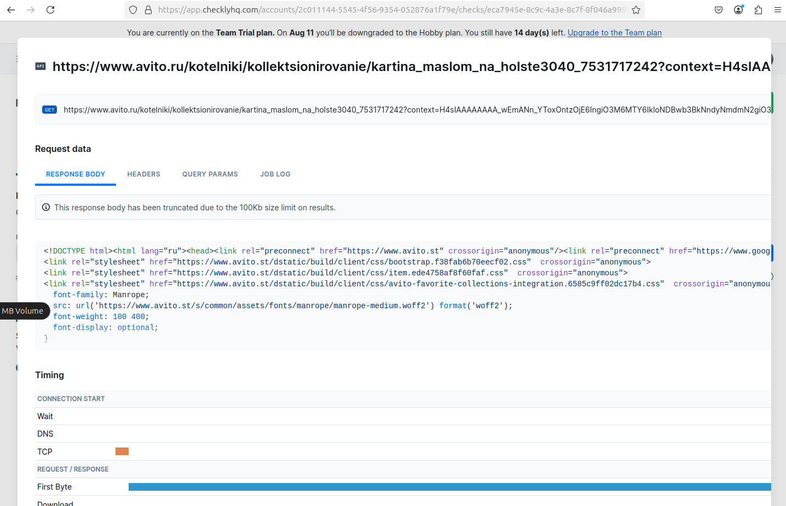

SRE Lab
In this lab, you will explore the principles of Site Reliability Engineering (SRE). Follow the tasks below to complete the lab assignment.

Task 1: Key Metrics for SRE and SLAs
Objective: Monitor system resources and manage disk space.

Monitor System Resources:

Use commands like htop and iostat to monitor CPU, memory, and I/O usage.

Identify and document the top 3 most consuming applications for CPU, memory, and I/O usage in a submission8.md file.
Disk Space Management:

Use du and df to manage disk space.

Identify and log the top 3 largest files in the /var directory in the submission8.md file.
Documentation:

Create a submission8.md file.
Provide the output and analysis of the monitored metrics and disk space management.
Task 2: Practical Website Monitoring Setup
Objective: Set up real-time monitoring for any website using Checkly. You'll create checks for:

Basic availability (is the site loading?)
Content validation (is a key element visible?)
Interaction performance (how long does a button click take?)
Alerting (get notified when something breaks)
Step 1: Choose Your Website
Pick ANY public website you want to monitor (e.g., your favorite store, news site, or portfolio)

Step 2: Create Checks in Checkly
Sign up at Checkly (free account)
Create API Check for basic availability:
URL: Your chosen website

Assertion: Status code is 200
Create Browser Check for content & interactions:
URL: Same website
Step 3: Set Up Alerts
Configure alert rules of YOUR choice:

What to alert on? (e.g., failed checks, slow latency)
How to be notified? (email, telegram, etc.)
Set thresholds that make sense for your site
Step 4: Capture Proof & Documentation
Run checks manually to verify they work
Take screenshots and add them to submission8.md showing:
Your browser check configuration
A successful check result

Your alert settings