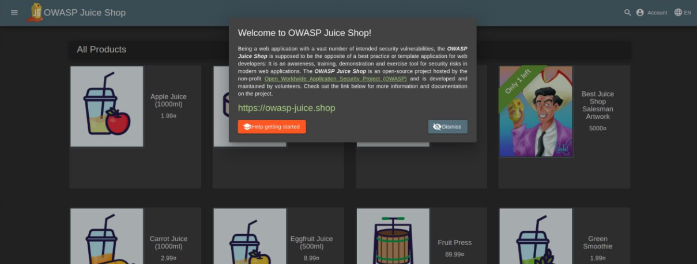
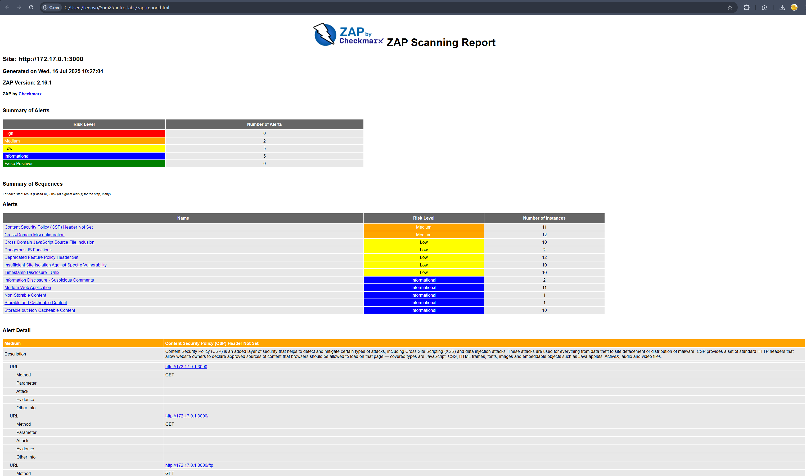

# Лабораторная работа 9: Безопасность Web-приложений и контейнеров

> Работа выполнена локально на Ubuntu 22.04 с использованием Docker. Все уязвимые приложения запускались только в изолированной среде, как указано в задании. В процессе сканирования использовались OWASP ZAP и Trivy.

---

## Задание 1: Сканирование Web-приложения с OWASP ZAP

### 1. Запуск Juice Shop

Сначала был запущен уязвимый сервис:

```bash
docker run -d --name juice-shop -p 3000:3000 bkimminich/juice-shop
```

**Вывод команды:**
```text
Unable to find image 'bkimminich/juice-shop:latest' locally
latest: Pulling from bkimminich/juice-shop
...
Status: Downloaded newer image for bkimminich/juice-shop:latest
```

Проверил доступность по адресу `http://localhost:3000`.

### 2. Сканирование OWASP ZAP

На моей системе (Ubuntu) `host.docker.internal` не работает, поэтому использовал IP `172.17.0.1`, определенный через `ip addr show docker0`.

```bash
docker run --rm -u zap -v $(pwd):/zap/wrk:rw   -t ghcr.io/zaproxy/zaproxy:stable zap-baseline.py   -t http://172.17.0.1:3000   -g gen.conf   -r zap-report.html
```

**Вывод (сокращен):**
```text
Medium (2) Content Security Policy (CSP) Header Not Set
Medium (2) Cross-Domain Misconfiguration
```

Открытие `zap-report.html` в браузере показало:

- **Content-Security-Policy Header Not Set** — отсутствие CSP увеличивает риск XSS-атак.
- **Cross-Domain Misconfiguration** — ошибка настройки CORS.



### 3. Остановка контейнера

```bash
docker stop juice-shop && docker rm juice-shop
```

---

## Задание 2: Проверка образа с помощью Trivy

### 1. Сканирование образа Juice Shop

```bash
docker run --rm -v /var/run/docker.sock:/var/run/docker.sock   aquasec/trivy:latest image --severity HIGH,CRITICAL bkimminich/juice-shop
```

**Вывод (фрагмент):**
```text
bkimminich/juice-shop (debian 12.11)
====================================
Total: 27 (HIGH: 19, CRITICAL: 8)

┌─────────┬───────────────┬──────────┬──────────┬───────────────────┬───────────────┬───────────────────────────────────────────────────────────┐
│ Library │ Vulnerability │ Severity │  Status  │ Installed Version │ Fixed Version │                           Title                           │
├─────────┼───────────────┼──────────┼──────────┼───────────────────┼───────────────┼───────────────────────────────────────────────────────────┤
│ ip      │ CVE-2023-42282│ CRITICAL │ unfixed  │ 2.0.1             │ 2.1.0         │ IP address parsing bypass vulnerability                  │
│ jsonwebtoken │ CVE-2015-9235 │ CRITICAL │ unfixed  │ 4.2.0        │ 9.0.0         │ Token verification bypass                                │
└─────────┴───────────────┴──────────┴──────────┴───────────────────┴───────────────┴───────────────────────────────────────────────────────────┘
```

### 2. Результаты

- **Critical vulnerabilities in Juice Shop image**: 8
- **Vulnerable packages**:
  1. `ip`
  2. `jsonwebtoken`
- **Dominant vulnerability type**: Token verification bypass, CVE-2023 class

**Комментарий**: многие уязвимости устраняются обновлением зависимостей, что подтверждает важность регулярной пересборки образов.

---

## Итоги

### Task 1 Results
- Juice Shop vulnerabilities found (Medium): 2
- Most interesting vulnerability found: Content Security Policy Header Not Set
- Security headers present: Нет

### Task 2 Results
- Critical vulnerabilities in Juice Shop image: 8
- Vulnerable packages:
  1. ip
  2. jsonwebtoken
- Dominant vulnerability type: Token verification bypass
